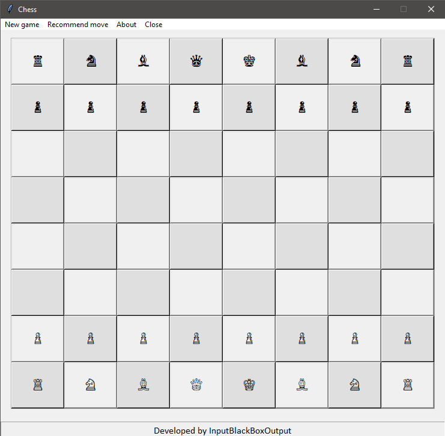
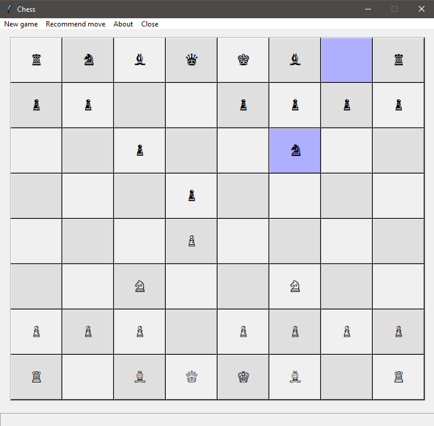
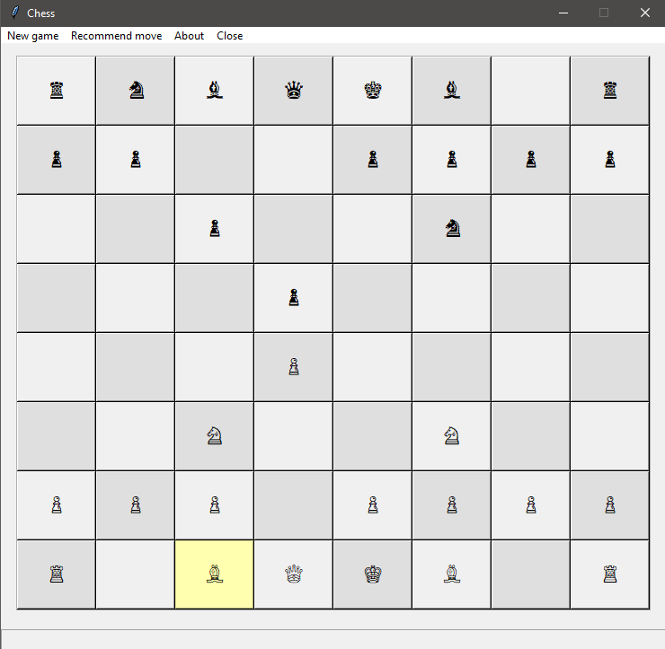
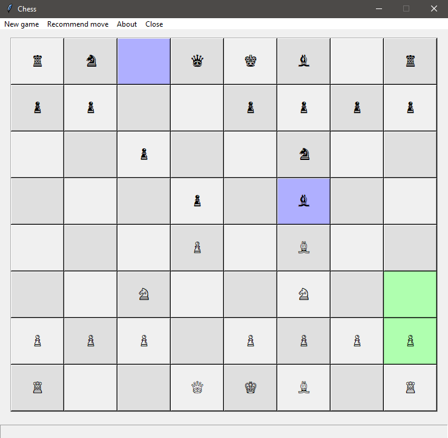

# Chessboard
Chess application built using Python 3

Open command prompt and enter <code>python gui.py</code> or double clik gui.py to start

## Features
- Uses stockfish chess engine
- Graphical User Interface (GUI) built using tkinker module
- Moves are marked using different colours
- Recommends moves to user

## Screenshots
|||
|--|--|
|||
|New game|Computer's move|
|||
|User selected piece to move|Recommended move|

 

### Made with lots of ⏱️, 📚 and ☕ by [InputBlackBoxOutput](https://github.com/InputBlackBoxOutput)
